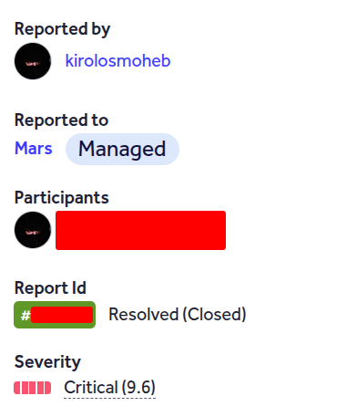
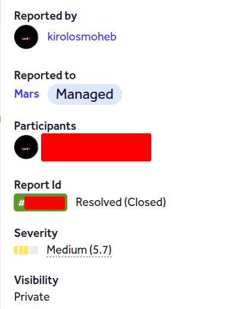
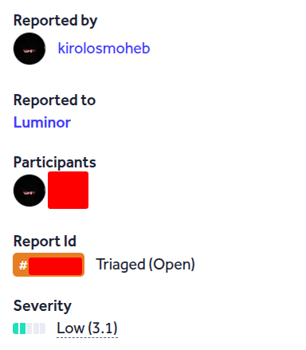
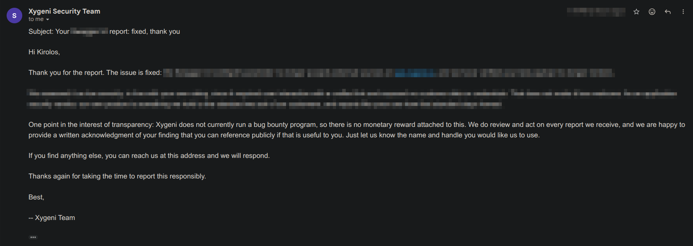

Hello Friend, I'm **KirolosMoheb**(_**0xh1jack**_) This is My Blog To Publish any Thing Belongs To Security Like : Bugs I Found in Applications, CTF Writeups, Security Tips & Tricks, etc. That I Want to Share it with The Security Community !

You Can Take a Look on My [**_Hackerone Account_**](https://hackerone.com/0xh1jack?type=user)

Medium:  [**_0xh1jack.medium.com_**](https://0xh1jack.medium.com/) 

Reach Me on [**_contact.me.kiro@gmail.com_**](mailto:contact.me.kiro@gmail.com) 

## Acknowledgements :

_>_ [**_Mars_**](https://mars.com)

_>_ [**_Luminor Bank_**](https://luminor.ee)

_>_ [**_Abbott_**](https://abbott.com)

_>_ [**_xygeni (Security Company)_**](https://xygeni.io/)

<!-- Company bar -->

<!-- Grid End Photos Section -->

  
  
  
  
  

<!-- Company bar -->